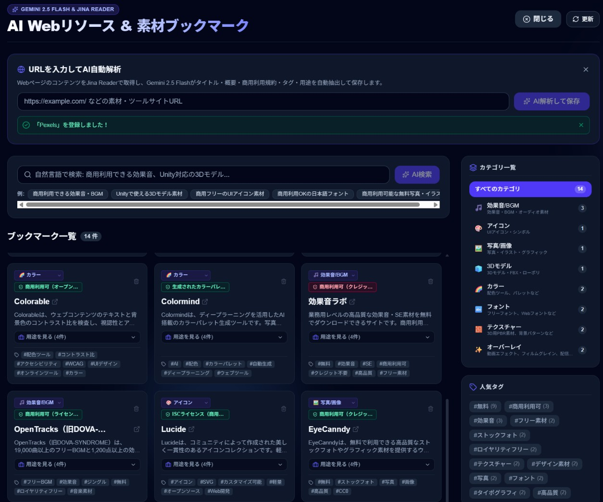
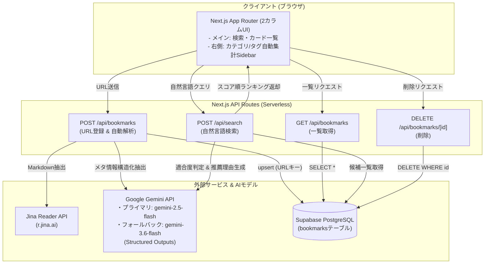

# 11_Bookmark-Manage-tool

> **AIを活用したWebリソース・クリエイティブ素材のスマートブックマーク管理ツール**<br>
> Portfolio_Tools_PJ #11

---

## 📌 デモ & スクリーンショット

### 🔗 Demo URL
- **Live Demo**: `[デモURL準備中（Vercelデプロイ後に記載予定）]`

> [!NOTE]
> **ポートフォリオ公開用のサンドボックス（お試しデモ）仕様について**  
> 本公開デモ環境は、データベースを汚染せずどなたでも安全にリアルタイムAI解析をお試しいただけるよう、**メモリ上（React State）で完結するサンドボックス仕様**で稼働しています。<br>
> 訪問者がURLを入力すると、Jina Reader ＆ Gemini 2.5 Flash が**本物のリアルタイム解析を行って即座にカードを追加**し、推薦検索やカテゴリ変更を自由に試せます（ブラウザ更新で元のサンプル状態に戻ります）。<br>
> ※ローカル開発環境では、Supabase（PostgreSQL）による完全なデータ永続化に対応しています。

### 📸 スクリーンショット


### 🎥 Demo Video
https://github.com/user-attachments/assets/15589f81-1d3e-4c7b-9ae2-83f1dfdfd75b

---

## 📖 プロジェクト概要

Web制作、ゲーム開発、動画編集などにおいて、高品質なフリー素材サイトや開発リソース（3Dモデル、効果音、アイコン、フォントなど）は日々増え続けています。<br>
しかし、従来のブラウザブックマークでは以下の課題がありました：

- **商用利用規約やライセンス条件（CC0、クレジット必須等）を後から思い出しにくい**
- **「何に使える素材か（ユースケース）」がタイトルから分からず死蔵する**
- **「商用フリーの3D素材」「ダークテーマに合うフォント」といった目的別の検索ができない**

本ツールは、**URLを登録するだけでJina ReaderとGoogle Geminiがサイトを即座に自動解析**し、概要・カテゴリ・タグ・用途・商用利用規約を構造化抽出してデータベースに保存。<br>
さらに「商用利用できる効果音」「Unity対応の3Dモデル」といった**自然言語のあいまいな要望から、AIが最適なリソースを推薦理由付きで絞り込める**ブックマーク管理ツールです。

---

## ✨ 主な機能

### 1. URL登録 & AI自動解析 (`POST /api/bookmarks`)
- URLを入力するだけで、**Jina Reader API (`https://r.jina.ai/{url}`)** を用いて対象ページのMarkdownテキストを取得。
- **Google Gemini API (`gemini-2.5-flash`) の Structured Outputs** を使用して、以下の情報を厳密なJSON形式で抽出：
  - **サイト名・タイトル (`title`)**
  - **概要日本語要約 (`summary`)**
  - **カテゴリ分類 (`category`)**
  - **キーワードタグ配列 (`tags`)**
  - **おすすめの用途リスト (`useCases`)**
  - **商用利用可否・ライセンス情報 (`commercialUse`)**
- **多層フォールバック機構**:
  - Cloudflare等のBot保護（403 Forbidden）があるサイトでも、ブラウザUA直接フェッチおよびGemini自身のWebナレッジフォールバックにより、登録エラーを防ぎます。
  - Gemini APIの高負荷（503）発生時は、自動リトライおよび `gemini-3.6-flash` へのモデルフォールバックを実行。
- Supabaseの `bookmarks` テーブルへ保存（URL重複時は更新 / upsert）。

### 2. 2カラム構成 & コンパクトUI (`src/app/page.tsx`)
- **メインコンテンツ（左75%）**:
  - AI自然言語検索バー & クイック検索サジェストチップ。
  - 適用中フィルター（クエリ、カテゴリ、タグ）のワンクリック解除バー。
  - **横3列（`xl:grid-cols-3`）のコンパクトカード表示**:
    - 概要文は2行省略（`line-clamp-2`）で均一化。
    - 「おすすめの用途」は初期折りたたみ式で、アコーディオン展開によりカードの高さを大幅にスリム化。
    - 商用利用ステータス（商用OKなら緑、注意なら黄/赤）の視覚的バッジ表示。
- **Stickyサイドバー（右25%）**:
  - 画面を下にスクロールしても常に追従する `sticky top-6` 設計。
  - 保存済みリソースから**カテゴリ別の登録件数を自動集計**し、1クリックで即時フィルタリング。
  - **人気タグクイックフィルター**（#無料、#商用利用可、#CC0など）。
  - 登録総数・カテゴリ数のミニ統計ウィジェット。
- **省スペース登録フォーム**:
  - ヘッダー右上の「新規リソース登録」ボタンでアコーディオン開閉。ファーストビューを広く確保。

### 3. AI自然言語推薦検索 (`POST /api/search`)
- 「商用利用できる効果音」「Unityで使える3D素材」など、日常の言葉でリソースを検索。
- Geminiが保存済みブックマークの要約・タグ・商用利用条件・用途を総合評価し、**適合度スコア（1〜100%）** と **AI推薦理由（なぜマッチしたかのおすすめコメント）** を付与して関連度順に返却。
- 検索結果カード上部に推薦理由ハイライトバナーを表示。

### 4. ブックマーク削除 (`DELETE /api/bookmarks/:id`)
- カード右上のゴミ箱アイコンから、不要になったブックマークを即時削除。

---

## 🏗️ システムアーキテクチャ & 処理フロー



---

## 🛠️ 技術スタック

| 分類 | 技術・サービス | バージョン / 用途 |
|---|---|---|
| **フロントエンド** | Next.js (App Router) | v16.3.6 (React 19, TypeScript) |
| **スタイリング** | Tailwind CSS | v4.0 |
| **アイコン** | Lucide React | v1.47.0 |
| **バックエンド** | Next.js Route Handlers | Node.js Runtime |
| **AI / LLM** | Google Gemini API (`@google/genai`) | プライマリ: `gemini-2.5-flash`<br>高負荷フォールバック: `gemini-3.6-flash` |
| **Webスクレイピング** | Jina Reader API | `https://r.jina.ai/{url}` (Markdown変換) |
| **データベース** | Supabase (PostgreSQL) | `@supabase/supabase-js` (RLS有効) |
| **ホスティング想定** | Vercel | Serverless Functions |

---

## 🚀 ローカルセットアップ手順

### 1. 前提条件
- Node.js 20.x 以上
- npm / pnpm

### 2. リポジトリのクローン & インストール
```bash
git clone https://github.com/your-username/11_Bookmark-Manage-tool.git
cd 11_Bookmark-Manage-tool
npm install
```

### 3. 環境変数の設定
プロジェクト直下に `.env.local` を作成し、必要なキーを設定してください（`.env.example` 参照）。

```env
# Supabase 接続情報 (Project Settings > API)
NEXT_PUBLIC_SUPABASE_URL=https://your-project.supabase.co
NEXT_PUBLIC_SUPABASE_ANON_KEY=your-anon-key

# Google Gemini API キー (Google AI Studio)
GEMINI_API_KEY=your-gemini-api-key
```

### 4. Supabase テーブルの作成
Supabase ダッシュボードの **SQL Editor** を開き、[`supabase/schema.sql`](supabase/schema.sql) の内容を実行してください。

```sql
create table if not exists public.bookmarks (
    id uuid primary key default gen_random_uuid(),
    created_at timestamptz default timezone('utc'::text, now()) not null,
    url text unique not null,
    title text not null,
    summary text not null,
    category text not null,
    tags text[] default '{}'::text[],
    use_cases text[] default '{}'::text[],
    commercial_use text not null,
    raw_content text
);

create index if not exists bookmarks_created_at_idx on public.bookmarks (created_at desc);
create index if not exists bookmarks_category_idx on public.bookmarks (category);

alter table public.bookmarks enable row level security;
create policy "Allow public read access" on public.bookmarks for select using (true);
create policy "Allow public insert access" on public.bookmarks for insert with check (true);
create policy "Allow public update access" on public.bookmarks for update using (true);
create policy "Allow public delete access" on public.bookmarks for delete using (true);
```

### 5. 開発サーバーの起動
```bash
npm run dev
```
ブラウザで [http://localhost:3000](http://localhost:3000) を開いてご利用ください。

### 6. プロダクションビルド
```bash
npm run build
npm run start
```

---

## 🔐 環境変数の説明

| 変数名 | 必須 | 説明 | 取得先 |
|---|:---:|---|---|
| `NEXT_PUBLIC_SUPABASE_URL` | ○ | SupabaseプロジェクトのAPI URL (`https://<project-ref>.supabase.co`) | Supabase Project Settings > API |
| `NEXT_PUBLIC_SUPABASE_ANON_KEY` | ○ | Supabaseの公開匿名APIキー (anon key) | Supabase Project Settings > API |
| `GEMINI_API_KEY` | ○ | Google Gemini APIを利用するためのAPIキー | [Google AI Studio](https://aistudio.google.com/app/apikey) |

> [!NOTE]
> `NEXT_PUBLIC_SUPABASE_URL` に誤ってダッシュボード（SQL Editor等）のブラウザURLが設定された場合でも、コード内の `normalizeSupabaseUrl` 関数により自動的に正規のAPI URLへ補正されます。

---

## 📊 現在の完成状態 (MVP)

- [x] URL入力からのJina Reader + Gemini Structured Outputsによる自動解析
- [x] Cloudflare等のBot保護サイトに対する耐障害性フォールバック（Geminiナレッジ推論）
- [x] Gemini API一時負荷（503）時の自動リトライ＆フォールバック（`gemini-2.5-flash` ➔ `gemini-3.6-flash`）
- [x] Supabaseへのupsert保存および削除機能
- [x] 自然言語クエリによる関連度判定・推薦理由付き検索
- [x] 2カラム構成UI（メイン75%＋Sticky右サイドバー25%）
- [x] カテゴリ・タグの自動集計＆ワンクリックフィルタリング
- [x] 横3列コンパクトカード ＆ おすすめ用途のアコーディオン表示
- [x] 省スペース型登録フォーム（開閉アコーディオン）

---

## 🔮 既知の制約 & 今後の改善課題

本バージョンはMVP（最小実用製品）としてコア機能を完成させています。今後のアップデートで以下を検討しています：

1. **ページネーション / 無限スクロール**:
   - 現在は全件取得してクライアント側でフィルタリングしています。登録数が数百件を超えた場合の仮想スクロールまたはカーソルベースのページネーションの導入。
2. **OGPサムネイル画像の自動取得 & プレビュー表示**:
   - 各サイトのOGP画像を取得し、カード上部にアイキャッチ画像を表示して視認性をさらに向上。
3. **ユーザー認証（Supabase Auth）とマルチユーザー対応**:
   - 現在は全ユーザー共通のブックマーク管理となっています。ユーザーごとの個別管理機能の追加。
4. **ブラウザ拡張機能（Chrome Extension）連携**:
   - 閲覧中のタブから1クリックでブックマークを直接登録できる拡張機能の開発。
